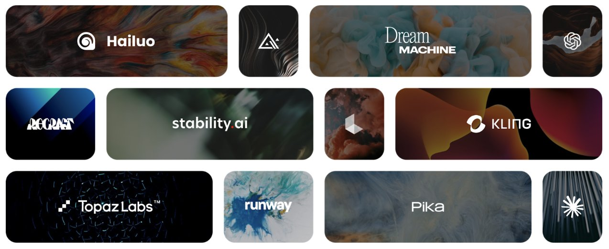

[FloraFauna.ai](https://www.florafauna.ai/) provides an awesome visual storyboard creator:

<a href="https://www.florafauna.ai/"></a>



# StoryBoard Input

The following work is independent of FloraFauna.  The script creates storyboard .csv files and pushes them to GitHub.
<!--
We're creating processes for sharing storyboards by exporting and importing files within collaborative workspaces.
-->

## Loads prompts from .csv files and outputs to GitHub

Enter a prompt or load prompts from a .csv file.

Images are generated in different aspect ratios and can be saved directly to a GitHub repository for display in our [JQuery Gallery](https://model.earth/data-pipeline/research/stream/) or [React Gallery](https://model.earth/react-gallery/view/).

### Features

- **Prompt Selection**: Users can choose from a variety of predefined prompts listed in a .csv file.
- **Image Generation**: The app generates images based on the selected prompt using the Replicate model.
- **Multiple Aspect Ratios**: Supports the creation of images in square and horizontal formats.
- **GitHub Integration**: Automatically saves generated images to a specified GitHub repository.


## Getting Started

You'll be running a Streamlit app that transforms text prompts in .csv files into storyboard images.  

### Prerequisites

- Streamlit
- Pandas
- Replicate Python Client
- Python Requests
- Pillow (PIL)

### Installation

1.) Clone the repository to your local computer.

2.) Navigate to the directory, start a virtual env, and install the required packages:
   
   For mac:

   ```bash
   python3 -m venv env && 
   source env/bin/activate &&
   pip install -r requirements.txt
   ```
   For windows:
```bash
   python3 -m venv env && 
   env\Scripts\activate &&
   pip install -r requirements.txt
   ```
3.) Save a copy of example_secrets.toml as secrets.toml

4.) If you will be sending files to your GitHub account, in .streamlit/secrets.toml add:

GITHUB\_TOKEN
GITHUB\_REPOSITORY

To create a GITHUB_TOKEN, in GitHub.com go to: Settings -> Developer Settings -> [Personal access tokens](https://github.com/settings/tokens).  
Checking the first three checkboxes should suffice: repo, workflow and write:packages

The GITHUB_REPOSITORY would be your own repo, in this format: [your account]/[your repo]

5.) Set your Replicate API Token in .streamlit/secrets.toml. 

You can get a free [Replicate API Token](https://replicate.com/docs/reference/http#authentication), but they are slow. [Purchased tokens](https://replicate.com/pricing) are affordable.
Avoid pasting the "bearer" portion.

6.) Update the .csv file with your prompts.

7.) Run our .csv prompt input version:

      streamlit run code_gen_images_sq_wide_ME.py

Or run the [original Streamlit app](https://github.com/tonykipkemboi/streamlit-replicate-img-app) (without .csv input, nor output to GitHub):

      streamlit run streamlit_app.py


8.) The Streamlit app should open automatically in your web browser at port 5 something.

9.) Use the sidebar to select a prompt from the .csv file.

10.) Click on 'Generate Image' to start the image generation process.

11.) View the generated images in different aspect ratios.

12.) Check your GitHub repository for the saved images.


## Contributing

Contributions to improve this project are welcome. Please follow these steps:

1. Fork the repository.
2. Create a new branch for your feature or fix.
3. Commit your changes.
4. Push to the branch.
5. Open a pull request.